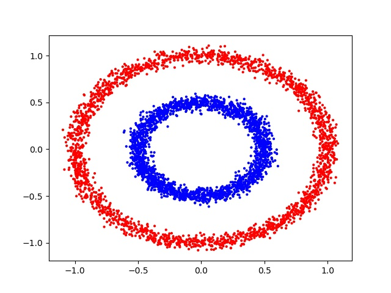
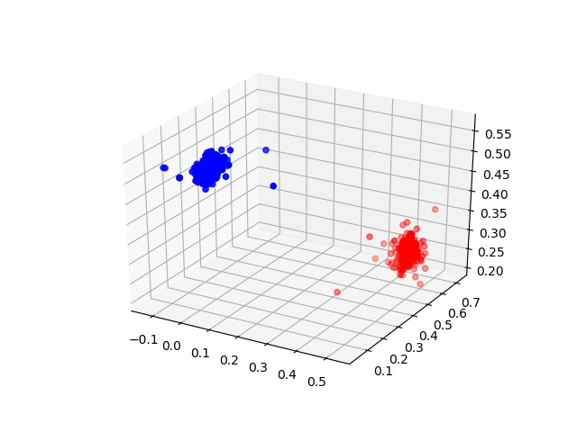
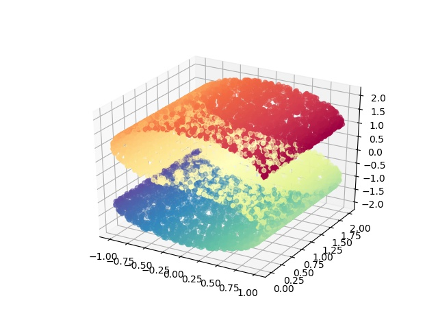
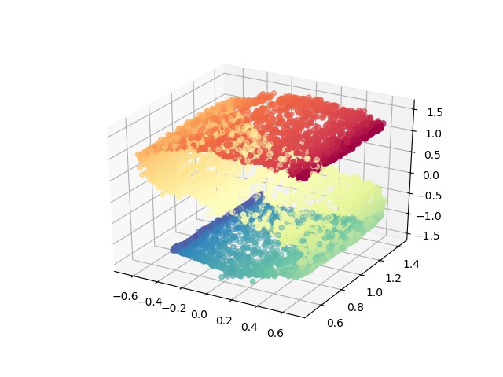
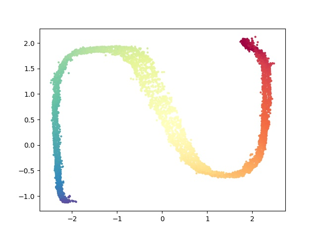
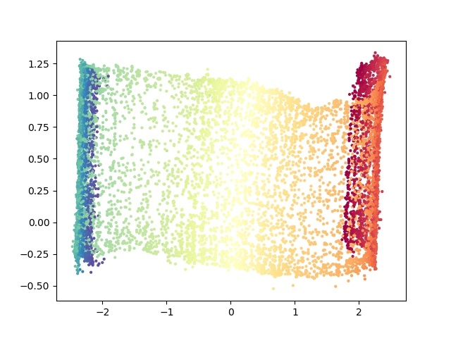

# Multi-Layered Gradient Boosting Decision Trees

This is the official clone for the implementation of mGBDT. 

Package Official Website: http://lamda.nju.edu.cn/code_mGBDT.ashx

This package is provided "AS IS" and free for academic usage. You can run it at your own risk. For other purposes, please contact Prof. Zhi-Hua Zhou (zhouzh@lamda.nju.edu.cn).

Description: A python implementation of mGBDT proposed in [1].
A demo implementation of mGBDT library as well as some demo client scripts to demostrate how to use the code.
The implementation is flexible enough for modifying the model or fit your own datasets.

**Reference: [1] J. Feng, Y. Yu, and Z.-H. Zhou. [Multi-Layered Gradient Boosting Decision Trees](http://lamda.nju.edu.cn/fengj/paper/mGBDT.pdf). In:Advances in Neural Information Processing Systems 31 (NIPS'18), Montreal, Canada, 2018.**

ATTN: This package was developed and maintained by Mr.Ji Feng(http://lamda.nju.edu.cn/fengj/) .For any problem concerning the codes, please feel free to contact Mr.Feng.（fengj@lamda.nju.edu.cn) or open some issues here.

# Environments
- The code is developed under Python 3.5, so create a Python 3.5 environment using anaconda at first
```
conda create -n mgbdt python=3.5 anaconda
```
- Install the dependent packages
```
source activate mgbdt
conda install pytorch=0.1.12 cuda80 -c pytorch
pip install -r requirements.txt
```

# Demo Code

```
from sklearn import datasets
from sklearn.model_selection import train_test_split

# For using the mgbdt library, you have to include the library directory into your python path.
# If you are in this repository's root directory, you can do it by using the following codes
import sys
sys.path.insert(0, "lib")

from mgbdt import MGBDT, MultiXGBModel

# make a sythetic circle dataset using sklearn
n_samples = 15000
x_all, y_all = datasets.make_circles(n_samples=n_samples, factor=.5, noise=.04, random_state=0)
x_train, x_test, y_train, y_test = train_test_split(x_all, y_all, test_size=0.3, random_state=0, stratify=y_all)

# Create a multi-layerd GBDTs
net = MGBDT(loss="CrossEntropyLoss", target_lr=1.0, epsilon=0.1)

# add several target-propogation layers
# F, G represent the forward mapping and inverse mapping (in this paper, we use gradient boosting decision tree)
net.add_layer("tp_layer",
    F=MultiXGBModel(input_size=2, output_size=5, learning_rate=0.1, max_depth=5, num_boost_round=5),
    G=None)
net.add_layer("tp_layer",
        F=MultiXGBModel(input_size=5, output_size=3, learning_rate=0.1, max_depth=5, num_boost_round=5),
        G=MultiXGBModel(input_size=3, output_size=5, learning_rate=0.1, max_depth=5, num_boost_round=5))
net.add_layer("tp_layer",
        F=MultiXGBModel(input_size=3, output_size=2, learning_rate=0.1, max_depth=5, num_boost_round=5),
        G=MultiXGBModel(input_size=2, output_size=3, learning_rate=0.1, max_depth=5, num_boost_round=5))

# init the forward mapping
net.init(x_train, n_rounds=5)

# fit the dataset
net.fit(x_train, y_train, n_epochs=50, eval_sets=[(x_test, y_test)], eval_metric="accuracy")

# prediction
y_pred = net.forward(x_test)

# get the hidden outputs
# hiddens[0] represent the input data
# hiddens[1] represent the output of the first layer
# hiddens[2] represent the output of the second layer
# hiddens[3] represent the output of the final layer (same as y_pred)
hiddens = net.get_hiddens(x_test)
```

# Expriments

## circle datasets
By running the following scripts
- It will train a multi-layered GBDTs with structure (input - 5 - 3 - output) on the sythetic circle dataset
- The visualization of the input (which is 2D) will be saved in outputs/circle/input.jpg (as show below)
- The visualization of the second layer's output (which is 3D) will be saved in outputs/circle/pred2.jpg (as show below)
```
python exp/circle.py
```

Input                          |  Transformed
:-----------------------------:|:------------------------------:
 |  

## scurve datasets
By running the following scripts
- It will train an autoencoder using multi-layered GBDTs with structure (input - 5 - output) on the sythetic scurve dataset
- The visualization of the input (which is 3D) will be saved in outputs/circle/input.jpg (as show below)
- The visualization of the resonstructed result (which is 3D) will be saved in outputs/circle/pred2.jpg (as show below)
```
python exp/scurve.py
```

Input                             |  Reconstructed
:--------------------------------:|:----------------------------------:
    |  

- The visualization of the encoding will also be saved, since the 5D encodings are impossible to visualize directly, here we visualize every pairs of the 5 dimentions in 2D space.
- The visualization of the $i'th and $j'th dimension will be saved in outputs/scurve/pred2.$i_$j.jpg (as show below)

Dimension 1 and 2                 |  Dimension 1 and 5
:--------------------------------:|:----------------------------------:
 |  


## [UCI Adult](https://archive.ics.uci.edu/ml/datasets/adult)
At first, you need to download the dataset by running the following command:
```Shell
cd dataset/uci_adult
sh get_data.sh
```
Then, y running the following scripts
- It will train a multi-layered GBDTs with structure (input - 128 - 128 - output)
- the accuracy will be logged for each epochs
```
python exp/uci_adult.py
```

## [UCI Yeast](https://archive.ics.uci.edu/ml/datasets/Yeast)
By running the following scripts
- It will train a multi-layered GBDTs with structure (input - 16 - 16 - output)
- 10-fold cross-validation is used
- the accuracy will be logged for each epochs and each folds
```
python exp/uci_yeast.py
```
